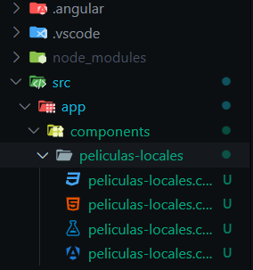
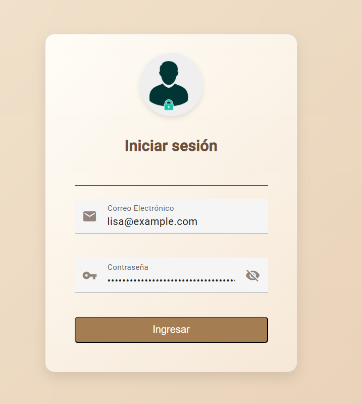
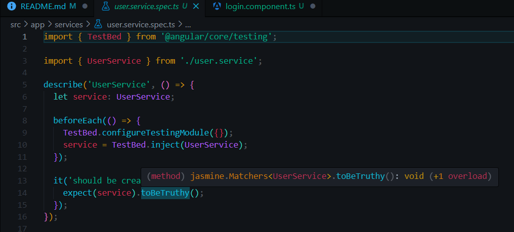
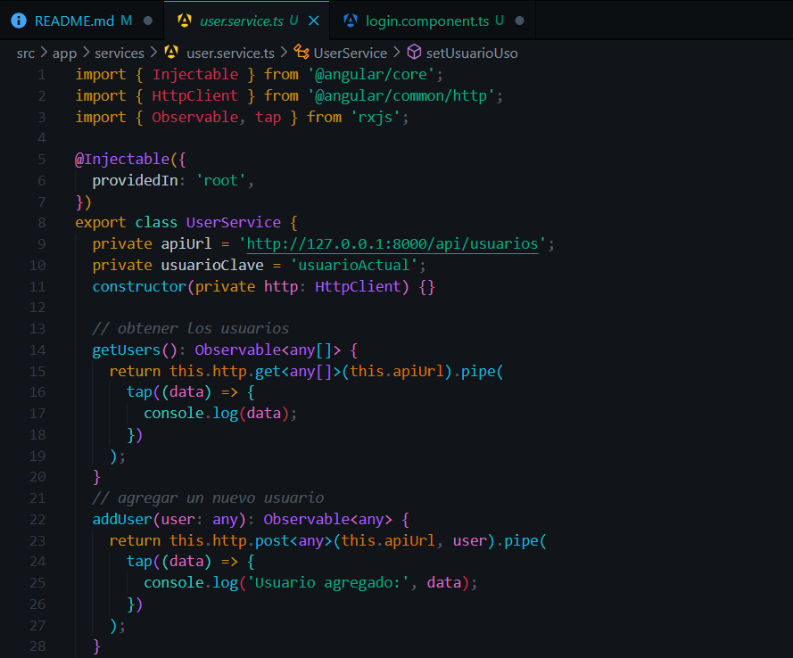
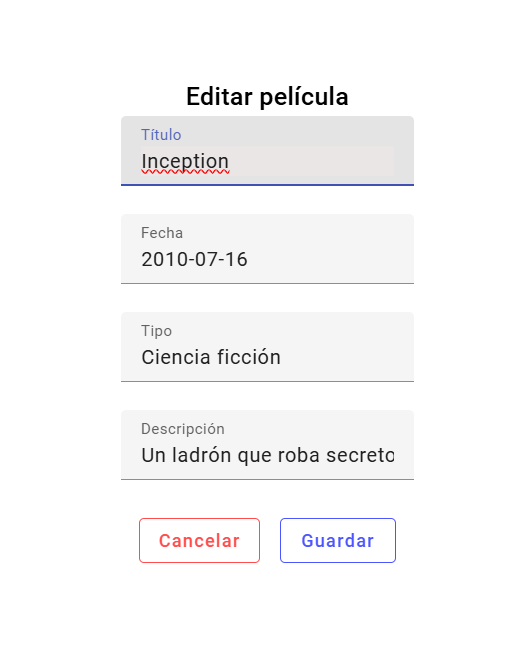
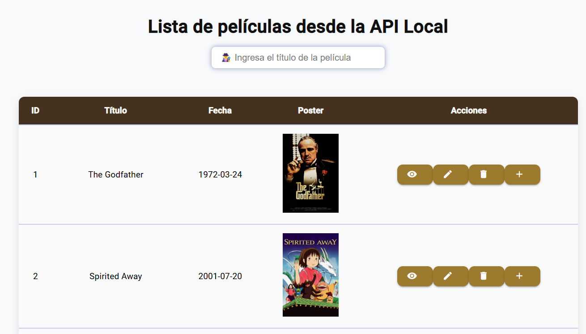

Proyecto Final-Angular de Usuarios y Peliculas 

Parte 1
Se crea una carpeta que se llamara "ProgramWebApiLaravel", haciendo click derecho, se abre la terminal, y se ejecuta el comando "ng new ProgramWebApiLaravel", despues aceptamos todo lo que se nos pide y se nos creara todos los arhivos necesarios.

Una vez finalizado, en el explorador de archivos se debera de mostrar lo siguiente:

Y desde Visual Studio Code, tambien se mostrara asi: 

******************************************************************************************************************************************

Parte 2
Desde la carpeta SRC, se estara trabajando, para ello, hay varias subcarpetas que la componen, pero el que se estara utilizando mas es "components", "home" y "services". 

En la carpeta se creara nuevas subcarpetas, que se llamara "peliculas-locales", estas tendran sus respectivos componentes, asi como se muestra en la siguiente imagen:

En el archivo "peliculas-locales.html", se diseñara la estructura de como debe de estar al momento de presentar las peliculas, asi como esta en el codigo 

    

      <h2 class="tituloTabla">Lista de películas desde la API Local</h2>
    

    

      <input matInput [(ngModel)]="buscador" (input)="buscar()"
        placeholder="🕵️‍♂️ Ingresa el título de la película" class="styled-input"/>
    

    

      <table class="table table-bordered table-striped">
        <thead>
          <tr>
            <th class="table-header">ID</th>
            <th class="table-header">Título</th>
            <th class="table-header">Fecha</th>
            <th class="table-header">Poster</th>
            <th class="table-header">Acciones</th>
          </tr>
        </thead>
        <tbody>
          <tr *ngFor="let movie of paginaPeliculas; let i = index">
            <td>{{ movie.idPelicula }}</td>
            <td>{{ movie.titulo }}</td>
            <td>{{ movie.fecha }}</td>
            <td></td>
            <td>
              <button mat-raised-button color="primary" (click)="abrirModal(movie)" class="action-btn">
                <mat-icon>visibility</mat-icon>
              </button>
              <button mat-raised-button color="accent" (click)="abrirEditModal(movie)" class="action-btn">
                <mat-icon>edit</mat-icon>
              </button>
              <button mat-raised-button color="accent" (click)="abrirEliminarModal(movie)" class="action-btn">
                <mat-icon>delete</mat-icon>
              </button> 
              <button mat-raised-button color="accent" (click)="abrirAgregarModal()" class="action-btn">
                <mat-icon>add</mat-icon>
              </button>
            </td>
          </tr>
        </tbody>
      </table>
    

    

      <paginacion [length]="peliculas.length" [pageSize]="paginacionInicial"
        [pageSizeOptions]="[5, 10, 50, 100]"(page)="onPageChange($event)"></paginacion>
    

  

  <!--modal de detalles-->
  <ng-template #modalDetalles>
    <mat-card class="modal">
      <mat-card-header>
        <mat-card-title>{{ peliculaSeleccionada?.titulo }}</mat-card-title>
        <mat-card-subtitle>Fecha: {{ peliculaSeleccionada?.fecha }}</mat-card-subtitle>
        <mat-card-subtitle>Tipo: {{ peliculaSeleccionada?.Tipo }}</mat-card-subtitle>
        <mat-card-subtitle>Descripción: {{ peliculaSeleccionada?.Descripcion }}</mat-card-subtitle>
      </mat-card-header>
      <mat-card-content>
        

          
        

      </mat-card-content>
      <mat-card-actions>
        <button mat-stroked-button (click)="cerrarModal()">
          Cerrar
        </button>
      </mat-card-actions>
    </mat-card>
  </ng-template>
  <!--Editar-->
  <ng-template #modalEditar>
    <mat-card class="modal">
      <mat-card-title >Editar película</mat-card-title>
      <mat-card-content>
        <form class="formularioEditar">
          <mat-form-field>
            <mat-label>Título</mat-label>
            <input matInput type="text" [(ngModel)]="editMovie.titulo" name="titulo" />
          </mat-form-field>
          <mat-form-field>
            <mat-label>Fecha</mat-label>
            <input matInput type="text" [(ngModel)]="editMovie.fecha" name="año" />
          </mat-form-field>
          <mat-form-field>
            <mat-label>Tipo</mat-label>
            <input matInput type="text" [(ngModel)]="editMovie.Tipo" name="tipo" />
          </mat-form-field>
          <mat-form-field>
            <mat-label>Descripción</mat-label>
            <input matInput type="text" [(ngModel)]="editMovie.Descripcion" name="descripcion" />
          </mat-form-field>
        </form>
      </mat-card-content>
      <mat-card-actions>
        <button mat-stroked-button (click)="cerrarEditModal()">Cancelar</button>
        <button mat-flat-button (click)="guardarCambios()">Guardar</button>
      </mat-card-actions>
    </mat-card>
  </ng-template>
  <!-- Modal para confirmar eliminacion -->
  <ng-template #modalConfirmarEliminacion>
    <mat-card class="modal">
      <mat-card-title>¿Estás seguro de que deseas eliminar esta película?</mat-card-title>
      <mat-card-content>
        
Título: <strong>{{ peliculaEliminada?.titulo }}</strong>

        
Fecha: <strong>{{ peliculaEliminada?.fecha }}</strong>

      </mat-card-content>
      <mat-card-actions>
        <button mat-stroked-button (click)="cerrarEliminarModal()">Cancelar</button>
        <button mat-flat-button  (click)="confirmEliminacion()">Eliminar</button>
      </mat-card-actions>
    </mat-card>
  </ng-template>
  <!-- Modal para agregar nueva película -->
<ng-template #modalAgregar>
  <mat-card class="modal">
    <mat-card-title>Agregar nueva película</mat-card-title>
    <mat-card-content>
      <form class="formularioEditar">
        <mat-form-field>
          <mat-label>Título</mat-label>
          <input matInput type="text" [(ngModel)]="nuevaPelicula.titulo" name="titulo" />
        </mat-form-field>
        <mat-form-field>
          <mat-label>Fecha</mat-label>
          <input matInput type="text" [(ngModel)]="nuevaPelicula.fecha" name="año" />
        </mat-form-field>
        <mat-form-field>
          <mat-label>Tipo</mat-label>
          <input matInput type="text" [(ngModel)]="nuevaPelicula.Tipo" name="tipo" />
        </mat-form-field>
        <mat-form-field>
          <mat-label>Descripción</mat-label>
          <input matInput type="text" [(ngModel)]="nuevaPelicula.Descripcion" name="descripcion" />
        </mat-form-field>
        <mat-form-field>
          <mat-label>URL de la imagen</mat-label>
          <input matInput type="text" [(ngModel)]="nuevaPelicula.urlImagen" name="urlImagen" />
        </mat-form-field>
      </form>
    </mat-card-content>
    <mat-card-actions>
      <button mat-stroked-button (click)="cerrarAgregarModal()">Cancelar</button>
      <button mat-flat-button (click)="agregarPelicula()">Agregar</button>
    </mat-card-actions>
  </mat-card>
</ng-template>
  

  Y en el archivo "peliculas-locales.ts", se le dara el formato de diseño, en base a lo que nosotros queremos que se muestre para mayor presentacion y organizacion visual hacia el usuario quien lo visualizara

.container {
    display: flex;
    flex-direction: column;
    justify-content: center;
    align-items: center;
    padding: 20px;
  }
  .tituloTabla {
    font-size: 2rem;
    font-weight: bold;
    color: #111112;
    margin-bottom: 20px;
    text-align: center;
  }
  /* para la tabla */
  .table-container {
    width: 100%;
    max-width: 1000px;
    background-color: #fff;
    border-radius: 10px; 
    box-shadow: 0 6px 15px rgba(0, 0, 0, 0.1); 
    overflow-x: auto;
    margin-top: 30px;
  }
  .table {
    width: 100%;
    border-collapse: collapse;
    text-align: center;
  }
  .table-header {
    background-color: #44311f; 
    color: white;
    padding: 12px;
    font-weight: bold;
  }
  .table th, .table td {
    padding: 15px;
    text-align: center;
    font-size: 15px;
    border-bottom: 2px solid #cbcbf4; 
  }
  .table td {
    background-color: #fafafa;
  }
  /* botones para los modales */
  .action-btn {
    border-radius: 10px;
    background-color: rgb(156, 123, 47); 
    border: #ffffff; 
    color: white; 
  }
  .action-btn:hover {
    background-color: #000000; 
    color: white; 
    border: 1px solid #ffffff; 
  }
  .action-btn mat-icon {
    font-size: 18px;
  }
  /* para los modales */
  mat-card {
    border-radius: 8px;
    box-shadow: 0 2px 2px rgba(0, 0, 0, 0.4);
    background-color: #fff4f4;
    padding: 7rem;
    max-width: 490px;
  }
  mat-card-header {
    text-align: center;
  }
  mat-card-actions {
    display: flex;
    justify-content: flex-end;
    gap: 1rem;
  }
  /* para la busqueda*/
  .estiloBuscador {
    text-align: right;
    margin-bottom: 20px;
  }
  .styled-input {
    padding: 10px 15px;
    border: 1px solid #ccc;
    border-radius: 8px; 
    font-size: 16px; 
    width: 280px; 
    box-shadow: 0 0 8px rgba(63, 81, 181, 0.5);
  }
  .styled-input:focus {
    border-color: #6a4dff; 
    box-shadow: 0 0 8px rgba(63, 81, 181, 0.5);
    transform: scale(1.05); 
  }
  /*paginacion*/
  .pagination-container {
    margin-top: 20px;
    display: flex;
    justify-content: center;
  }
  /* para el modal de editar */
  .modal {
    box-shadow: 0 0px 10px rgba(0, 0, 0, 0.1);
    background-color: #fff;
    justify-content: center;
    align-items: center; 
  }
  .formularioEditar mat-form-field {
    width: 100%;
  }
 
  .formularioEditar input:focus {
    border-color: #3f51b5; 
    background-color: #eae6e6;
  }
  button[mat-stroked-button] {
    border: 1px solid #ff4c4c;
    color: #ff4c4c;
  }
  button[mat-stroked-button]:hover {
    background-color: #ff4c4c;
    color: white;
  }
  button[mat-flat-button] {
    border: 1px solid #4c55ff;
    color: #4c55ff;
  }
  button[mat-flat-button]:hover {
    background-color: #4c55ff;
    color: white;
  }
  
  Y en el archivo "peliculas-locales.ts", se implementara todas las funcionalidades que debera tener esa tabla, ya que estara el crud de Eliminar, Visualizar, Editar y Agregar, pero de igual forma tendra sus respectivas importaciones con otras clases, asi como esta en el codigo de a continuacion: 

    import { Component, OnInit, TemplateRef, ViewChild } from '@angular/core';
  import { peliculaslocalService } from '../../services/peliculas-local.service';
  import { CommonModule } from '@angular/common';
  import { PaginacionComponent } from '../../paginacion/paginacion.component';
  import { MatDialog, MatDialogModule } from '@angular/material/dialog'; 
  import { MatButtonModule } from '@angular/material/button';
  import { MatIconModule } from '@angular/material/icon';
  import { FormsModule } from '@angular/forms';
  import {MatCardModule} from '@angular/material/card';
  import { MatFormFieldModule } from '@angular/material/form-field';
  import { MatInputModule } from '@angular/material/input';

  @Component({
    selector: 'app-pelicula-local',
    standalone: true,
    imports: [CommonModule, PaginacionComponent, MatDialogModule,MatButtonModule,MatIconModule,FormsModule,MatCardModule,
    MatFormFieldModule,MatInputModule],
    templateUrl: './peliculas-locales.component.html',
    styleUrls: ['./peliculas-locales.component.css']
  })
  export class PeliculasLocalesComponent implements OnInit {
    //para obtener las peliculas que se muestran en la tabla
    peliculas: any[] = []; 
    //peliculas para el buscador
    todasPeliculas: any[] = []; 
    //para la paginacion
    paginaPeliculas: any[] = [];  
    paginacionInicial: number = 10; 
    currentPage: number = 1; 
    //para editar
    peliculaSeleccionada: any; 
    //para editar la pelicula
    editMovie: any = {}; 
    buscador: any;
    //constructructor para guardar el usuario
    constructor(private peliculasService: peliculaslocalService,public dialog: MatDialog ) {}
    ngOnInit(): void {
      //obtener las peliculas
      this.peliculasService.getPeliculasLocales().subscribe(
        (response: any[]) => {
          //como se devuelven varios areglos por lo que se unieron la busqueda de peliculas de distintos años se convinan con flatMap
          this.todasPeliculas = response; 
          this.peliculas = [...this.todasPeliculas];
          //para la paginacion
          this.modificarPaginacionPeliculas();  
        },
        (error: any) => {
          console.error('Error al obtener las películas:', error);
        }
      );
    }
    // para el cambio de página
    onPageChange(event: any): void {
      this.currentPage = event.pageIndex + 1; 
      this.paginacionInicial = event.pageSize;
      this.modificarPaginacionPeliculas();  
    }
    // actualizar peliculas segun la pagina
    modificarPaginacionPeliculas(): void {
      const peliculaInicial = (this.currentPage - 1) * this.paginacionInicial;
      const peliculaFinal = this.currentPage * this.paginacionInicial;
      this.paginaPeliculas = this.peliculas.slice(peliculaInicial, peliculaFinal);
      //para el id de la pelicula
      this.paginaPeliculas = this.paginaPeliculas.map((movie, index) => ({
      ...movie,
      idPelicula: peliculaInicial + index + 1, 
    }));
    }
    //PARA EL MODAL DE LOS DETALLES
    @ViewChild('modalDetalles') ModalVerDetalles!: TemplateRef<any>;  
    abrirModal(movie: any): void {
      this.peliculaSeleccionada = movie;
      this.dialog.open(this.ModalVerDetalles);
    }
    //cerrar el modal
    cerrarModal(): void {
      this.dialog.closeAll(); 
    }
    //PARA EL MODAL DE EDITAR
    @ViewChild('modalEditar') ModalEditarDetalles!: TemplateRef<any>;
    abrirEditModal(movie: any): void {
      this.editMovie = { ...movie }; 
      this.dialog.open(this.ModalEditarDetalles);
    }
    cerrarEditModal(): void {
      this.dialog.closeAll(); 
    }
    //actualizar tabla
    // peliculas-locales.component.ts

guardarCambios(): void {
  const index = this.peliculas.findIndex(
    (movie) => movie.id === this.editMovie.id  
  );
  
  if (index !== -1) {
    // servicio para actualizar la peli
    this.peliculasService.updatePelicula(this.editMovie.id, this.editMovie).subscribe(
      (response) => {
        // actualizar tabla
        this.peliculas[index] = { ...this.editMovie };
        //modificar paginacion  
        this.modificarPaginacionPeliculas();  
        this.dialog.closeAll();  
      },
      (error) => {
        console.error('Error al guardar los cambios:', error);
      }
    );
  }
}

    //PARA ELIMINAR
    @ViewChild('modalConfirmarEliminacion') confEliminarModal!: TemplateRef<any>; 
    peliculaEliminada: any; 
    abrirEliminarModal(movie: any): void {
      this.peliculaEliminada = movie; 
      this.dialog.open(this.confEliminarModal); 
    }
    cerrarEliminarModal(): void {
      this.dialog.closeAll(); 
    }
    // peliculas-locales.component.ts

confirmEliminacion(): void {
  if (this.peliculaEliminada) {
    // se llama al metodo de eliminar del servicio
    this.peliculasService.deletePelicula(this.peliculaEliminada.id).subscribe(
      (response) => {
        // se filtran las peliculas
        this.peliculas = this.peliculas.filter(
          (movie) => movie.id !== this.peliculaEliminada.id
        );
        //para gainacion
        this.modificarPaginacionPeliculas();  
        this.peliculaEliminada = null;
        this.dialog.closeAll();  
      },
      (error) => {
        console.error('Error al eliminar la película:', error);
      }
    );
  }
}

    buscar(): void {
      const term = this.buscador?.trim().toLowerCase() || ''; 
      //si no se busca nada
      if (term === '') {
        this.peliculas = [...this.todasPeliculas];
      } else {
        this.peliculas = this.todasPeliculas.filter((peli) =>
          peli.titulo.toLowerCase().includes(term)
        );
      }
      this.modificarPaginacionPeliculas();
    }
    @ViewChild('modalAgregar') ModalAgregar!: TemplateRef<any>;

nuevaPelicula: any = {}; 

abrirAgregarModal(): void {
  this.nuevaPelicula = {};  
  this.dialog.open(this.ModalAgregar);
}

cerrarAgregarModal(): void {
  this.dialog.closeAll();
}
agregarPelicula(): void {
  this.peliculasService.agregarPelicula(this.nuevaPelicula).subscribe(
    (response) => {
      // Si la API responde exitosamente, actualizamos la lista
      this.todasPeliculas.push(response);
      this.peliculas = [...this.todasPeliculas];  
      this.modificarPaginacionPeliculas();  
      this.dialog.closeAll();
    },
    (error) => {
      console.error('Error al agregar la película:', error);
    }
  );
}

  }

  Y es asi como se visualiza en el navegador:

  
  Ahora, se creara una nueva carpeta que se llama "user-list", en esta carpeta de igual forma contendra todos sus componentes necesarios de angular, asi como se muestra en la siguiente imagen:
  
  En el archivo "user-list.html", contendra su estructura necesaria, para que se este implementando la informacion de la API, este es su codigo: 

  

  

    <h2 class="tituloTabla">Lista de usuarios desde la API Local</h2>
  

  

    <input matInput [(ngModel)]="buscador" (input)="buscar()"
      placeholder="🕵️‍♂️ Ingresa el nombre del usuario" class="styled-input"/>
  

  

    <table class="table table-bordered table-striped">
      <thead>
        <tr>
          <th class="table-header">ID</th>
          <th class="table-header">Nombre</th>
          <th class="table-header">Correo</th>
          <th class="table-header">Acciones</th>
        </tr>
      </thead>
      <tbody>
        <tr *ngFor="let user of paginaUsuarios; let i = index">
          <td>{{ user.idUsuario }}</td>
          <td>{{ user.name }}</td>
          <td>{{ user.email }}</td>
          <td>
            <button mat-raised-button color="primary" (click)="abrirModal(user)" class="action-btn">
              <mat-icon>visibility</mat-icon>
            </button>
            <button mat-raised-button color="accent" (click)="abrirEditModal(user)" class="action-btn">
              <mat-icon>edit</mat-icon>
            </button>
            <button mat-raised-button color="warn" (click)="abrirEliminarModal(user)" class="action-btn">
              <mat-icon>delete</mat-icon>
            </button>
            <button mat-raised-button color="accent" (click)="abrirAgregarModal()" class="action-btn">
              <mat-icon>add</mat-icon>
            </button>
          </td>
        </tr>
      </tbody>
    </table>
  

  

    <paginacion [length]="usuarios.length" [pageSize]="paginacionInicial"
      [pageSizeOptions]="[5, 10, 50, 100]" (page)="onPageChange($event)"></paginacion>
  

<!-- modal Detalles -->
<ng-template #modalDetalles>
  <mat-card class="modal">
    <mat-card-header>
      <mat-card-title>{{ usuarioSeleccionado?.name }}</mat-card-title>
      <mat-card-subtitle>Correo: {{ usuarioSeleccionado?.email }}</mat-card-subtitle>
    </mat-card-header>
    <mat-card-actions>
      <button mat-stroked-button (click)="cerrarModal()">Cerrar</button>
    </mat-card-actions>
  </mat-card>
</ng-template>
<!-- modal Editar -->
<ng-template #modalEditar>
  <mat-card class="modal">
    <mat-card-title>Editar Usuario</mat-card-title>
    <mat-card-content>
      <form>
        <mat-form-field>
          <mat-label>Nombre</mat-label>
          <input matInput [(ngModel)]="editUser.name" name="nombre"/>
        </mat-form-field>
        <mat-form-field>
          <mat-label>Correo</mat-label>
          <input matInput [(ngModel)]="editUser.email" name="correo"/>
        </mat-form-field>
        <mat-form-field>
          <mat-label>Rol</mat-label>
          <input matInput [(ngModel)]="editUser.role" name="role"/>
        </mat-form-field>
        <mat-form-field>
          <mat-label>Avatar</mat-label>
          <input matInput [(ngModel)]="editUser.avatar" name="avatar"/>
        </mat-form-field>
      </form>
    </mat-card-content>
    <mat-card-actions>
      <button mat-stroked-button (click)="cerrarEditModal()">Cancelar</button>
      <button mat-flat-button (click)="guardarCambios()">Guardar</button>
    </mat-card-actions>
  </mat-card>
</ng-template>

<!-- Modal Confirmar Eliminación -->
<ng-template #modalConfirmarEliminacion>
  <mat-card class="modal">
    <mat-card-title>¿Deseas eliminar este usuario?</mat-card-title>
    <mat-card-content>
      
Nombre: <strong>{{ usuarioEliminado?.name }}</strong>

      
Correo: <strong>{{ usuarioEliminado?.email }}</strong>

    </mat-card-content>
    <mat-card-actions>
      <button mat-stroked-button (click)="cerrarEliminarModal()">Cancelar</button>
      <button mat-flat-button (click)="confirmEliminacion()">Eliminar</button>
    </mat-card-actions>
  </mat-card>
</ng-template>

<!-- Modal Agregar Usuario -->
<ng-template #modalAgregar>
  <mat-card class="modal">
    <mat-card-title>Agregar Usuario</mat-card-title>
    <mat-card-content>
      <form>
        <mat-form-field>
          <mat-label>Nombre</mat-label>
          <input matInput [(ngModel)]="nuevoUsuario.name" name="nombre"/>
        </mat-form-field>
        <mat-form-field>
          <mat-label>Correo</mat-label>
          <input matInput [(ngModel)]="nuevoUsuario.email" name="correo"/>
        </mat-form-field>
        <mat-form-field>
          <mat-label>Rol</mat-label>
          <input matInput [(ngModel)]="nuevoUsuario.role" name="role"/>
        </mat-form-field>
        <mat-form-field>
          <mat-label>Avatar</mat-label>
          <input matInput [(ngModel)]="nuevoUsuario.avatar" name="avatar"/>
        </mat-form-field>
        <mat-form-field>
          <mat-label>Contraseña</mat-label>
          <input matInput [(ngModel)]="nuevoUsuario.password" name="password"/>
        </mat-form-field>
      </form>
    </mat-card-content>
    <mat-card-actions>
      <button mat-stroked-button (click)="cerrarAgregarModal()">Cancelar</button>
      <button mat-flat-button (click)="agregarUsuario()">Agregar</button>
    </mat-card-actions>
  </mat-card>
</ng-template>

Y este es de "user-list.component.css":

.container {
    display: flex;
    flex-direction: column;
    justify-content: center;
    align-items: center;
    padding: 20px;
  }
  .tituloTabla {
    font-size: 2rem;
    font-weight: bold;
    color: #111112;
    margin-bottom: 20px;
    text-align: center;
  }
  /* para la tabla */
  .table-container {
    width: 100%;
    max-width: 1000px;
    background-color: #fff;
    border-radius: 10px; 
    box-shadow: 0 6px 15px rgba(0, 0, 0, 0.1); 
    overflow-x: auto;
    margin-top: 30px;
  }
  .table {
    width: 100%;
    border-collapse: collapse;
    text-align: center;
  }
  .table-header {
    background-color: #44311f; 
    color: white;
    padding: 12px;
    font-weight: bold;
  }
  .table th, .table td {
    padding: 15px;
    text-align: center;
    font-size: 15px;
    border-bottom: 2px solid #cbcbf4; 
  }
  .table td {
    background-color: #fafafa;
  }
  /* botones para los modales */
  .action-btn {
    border-radius: 10px;
    background-color: rgb(156, 123, 47); 
    border: #ffffff; 
    color: white; 
  }
  .action-btn:hover {
    background-color: #000000; 
    color: white; 
    border: 1px solid #ffffff; 
  }
  .action-btn mat-icon {
    font-size: 18px;
  }
  /* para los modales */
  mat-card {
    border-radius: 8px;
    box-shadow: 0 2px 2px rgba(0, 0, 0, 0.4);
    background-color: #fff4f4;
    padding: 7rem;
    max-width: 490px;
  }
  mat-card-header {
    text-align: center;
  }
  mat-card-actions {
    display: flex;
    justify-content: flex-end;
    gap: 1rem;
  }
  /* para la busqueda*/
  .estiloBuscador {
    text-align: right;
    margin-bottom: 20px;
  }
  .styled-input {
    padding: 10px 15px;
    border: 1px solid #ccc;
    border-radius: 8px; 
    font-size: 16px; 
    width: 280px; 
    box-shadow: 0 0 8px rgba(63, 81, 181, 0.5);
  }
  .styled-input:focus {
    border-color: #6a4dff; 
    box-shadow: 0 0 8px rgba(63, 81, 181, 0.5);
    transform: scale(1.05); 
  }
  /*paginacion*/
  .pagination-container {
    margin-top: 20px;
    display: flex;
    justify-content: center;
  }
  /* para el modal de editar */
  .modal {
    box-shadow: 0 0px 10px rgba(0, 0, 0, 0.1);
    background-color: #fff;
    justify-content: center;
    align-items: center; 
  }
  .formularioEditar mat-form-field {
    width: 100%;
  }
  .formularioEditar input {
    font-size: 16px; 
    padding: 7px; 
    border: 1px solid #ddd; 
    border-radius: 4px; 
    background-color: #f9f9f9; 
  }
  .formularioEditar input:focus {
    border-color: #3f51b5; 
    background-color: #fff;
  }
  button[mat-stroked-button] {
    border: 1px solid #ff4c4c;
    color: #ff4c4c;
  }
  button[mat-stroked-button]:hover {
    background-color: #ff4c4c;
    color: white;
  }
  button[mat-flat-button] {
    border: 1px solid #4c55ff;
    color: #4c55ff;
  }
  button[mat-flat-button]:hover {
    background-color: #4c55ff;
    color: white;
  }
  
  Ahora, en el archivo "user-list.component.ts", contendra el funcionamiento que debera tener la tabla lo que es su CRUD, de Crear, Eliminar, Editar y Visualizar toda la informacion de la API que se este mostrando. Este es su codigo: 

  import { Component, OnInit, TemplateRef, ViewChild } from '@angular/core';
import { UserService } from '../../services/user.service';
import { CommonModule } from '@angular/common';
import { PaginacionComponent } from '../../paginacion/paginacion.component';
import { MatDialog, MatDialogModule } from '@angular/material/dialog'; 
import { MatButtonModule } from '@angular/material/button';
import { MatIconModule } from '@angular/material/icon';
import { FormsModule } from '@angular/forms';
import { MatCardModule } from '@angular/material/card';
import { MatFormFieldModule } from '@angular/material/form-field';
import { MatInputModule } from '@angular/material/input';

@Component({
  selector: 'app-user-list',
  standalone: true,
  imports: [CommonModule, PaginacionComponent, MatDialogModule, MatButtonModule, MatIconModule, FormsModule, MatCardModule, MatFormFieldModule,MatInputModule],
  templateUrl: './user-list.component.html',
  styleUrls: ['./user-list.component.css']
})
export class UserListComponent implements OnInit {
  usuarios: any[] = [];
  todosUsuarios: any[] = [];
  paginaUsuarios: any[] = [];
  paginacionInicial: number = 10;
  currentPage: number = 1;
  usuarioSeleccionado: any;
  editUser: any = {};
  buscador: any;
  nuevoUsuario: any = {};
  usuarioEliminado: any;

  constructor(private usuariosService: UserService, public dialog: MatDialog) {}

  ngOnInit(): void {
    this.usuariosService.getUsers().subscribe(
      (response: any[]) => {
        this.todosUsuarios = response;
        this.usuarios = [...this.todosUsuarios];
        this.modificarPaginacionUsuarios();
      },
      (error: any) => {
        console.error('Error al obtener usuarios:', error);
      }
    );
  }

  onPageChange(event: any): void {
    this.currentPage = event.pageIndex + 1;
    this.paginacionInicial = event.pageSize;
    this.modificarPaginacionUsuarios();
  }

  modificarPaginacionUsuarios(): void {
    const usuarioInicial = (this.currentPage - 1) * this.paginacionInicial;
    const usuarioFinal = this.currentPage * this.paginacionInicial;
    this.paginaUsuarios = this.usuarios.slice(usuarioInicial, usuarioFinal).map((user, index) => ({
      ...user,
      idUsuario: usuarioInicial + index + 1,
    }));
  }

  @ViewChild('modalDetalles') ModalVerDetalles!: TemplateRef<any>;
  abrirModal(user: any): void {
    this.usuarioSeleccionado = user;
    this.dialog.open(this.ModalVerDetalles);
  }
  cerrarModal(): void {
    this.dialog.closeAll();
  }

  @ViewChild('modalEditar') ModalEditarDetalles!: TemplateRef<any>;
  abrirEditModal(user: any): void {
    this.editUser = { ...user };
    this.dialog.open(this.ModalEditarDetalles);
  }
  cerrarEditModal(): void {
    this.dialog.closeAll();
  }

  guardarCambios(): void {
    const index = this.usuarios.findIndex((user) => user.id === this.editUser.id);
    if (index !== -1) {
      this.usuariosService.editUser(this.editUser.id, this.editUser).subscribe(
        (response) => {
          this.usuarios[index] = { ...this.editUser };
          this.modificarPaginacionUsuarios();
          this.dialog.closeAll();
        },
        (error) => {
          console.error('Error al guardar cambios:', error);
        }
      );
    }
  }

  @ViewChild('modalConfirmarEliminacion') confEliminarModal!: TemplateRef<any>;
  abrirEliminarModal(user: any): void {
    this.usuarioEliminado = user;
    this.dialog.open(this.confEliminarModal);
  }
  cerrarEliminarModal(): void {
    this.dialog.closeAll();
  }

  confirmEliminacion(): void {
    if (this.usuarioEliminado) {
      this.usuariosService.deleteUser(this.usuarioEliminado.id).subscribe(
        () => {
          this.usuarios = this.usuarios.filter((user) => user.id !== this.usuarioEliminado.id);
          this.modificarPaginacionUsuarios();
          this.usuarioEliminado = null;
          this.dialog.closeAll();
        },
        (error) => {
          console.error('Error al eliminar usuario:', error);
        }
      );
    }
  }

  buscar(): void {
    const term = this.buscador?.trim().toLowerCase() || '';
    if (term === '') {
      this.usuarios = [...this.todosUsuarios];
    } else {
      this.usuarios = this.todosUsuarios.filter((user) => user.name.toLowerCase().includes(term));
    }
    this.modificarPaginacionUsuarios();
  }

  @ViewChild('modalAgregar') ModalAgregar!: TemplateRef<any>;
  abrirAgregarModal(): void {
    this.nuevoUsuario = {};
    this.dialog.open(this.ModalAgregar);
  }
  cerrarAgregarModal(): void {
    this.dialog.closeAll();
  }

  agregarUsuario(): void {
    this.usuariosService.addUser(this.nuevoUsuario).subscribe(
      (response) => {
        this.todosUsuarios.push(response);
        this.usuarios = [...this.todosUsuarios];
        this.modificarPaginacionUsuarios();
        this.dialog.closeAll();
      },
      (error) => {
        console.error('Error al agregar usuario:', error);
      }
    );
  }
}

Y asi se ve en el navegador, de la tabla usuarios:

***************************************************************************************************************************

Parte 3
Para la parte de inicio de sesion, se reutilizo del anterior proyecto, solo se implemento la ruta de la api de usuarios que se creo desde Laravel, por cuenta propia de nosotras, en la parte del diseño asi quedo: 

Y en el codigo, de html, css y .st, quedo asi (solo una demostracion): 

Ahora para la parte de inicio de la pagina, de igual forma se reutilizo parte del codigo del anterior proyecto que se trabajo. Primeramente se creo la carpeta "login", y despues se fue implementando sus respectivos componentes de angular, a continuacion se muestra algunas imagenes de como es que se fue estructurando en el codigo:

Y es asi como se ve en el navegador:

***************************************************************************************************************************

Parte 4
Ahora en la carpeta "Service", se crearon 4 archivos, dos de ellos esta enfocado a peliculas y el otro a usuarios. En "peliculas-local.service.spec.ts", por defualt, implementa esto angular cuando se crea:

Pero en el archivo "peliculas-local.service.ts", se implementa la ruta de la api que se creo en laravel, que es esta "http://127.0.0.1:8000/api/peliculas", ahi mismo se implementa las funcionalidades para que se pueda eliminar, visualizar y editar las peliculas, asi como se muestra en la imagen: 

De igual forma, se hace para usuarios, en el archivo "user.service.spec.ts", se queda por default los componentes que da angular al momento de crearlo, asi como se muestra a continuacion:

En el archivo "user.service.ts", se implementa la url de la api que se creo en Laravel que es esta: "http://127.0.0.1:8000/api/usuarios", donde nos ayudara en la validacion de cuando se inicie sesion, y que se muestre la informacion de los usuarios en la tabla, con sus respectivas funcionalides que es de eliminar, crear y editar la informacion de la API, asi como se muestra la imagen:

***************************************************************************************************************************

Parte 5
Para visualizar los usuarios desde el navegador, se muestra asi con el boton del "ojo", y asi se ve: 

Para editar, de igual forma se hace mediante el boton del "lapiz", y se muestra asi:

Para eliminar se con el boton de "basura" y se muestra de la siguiente manera: 

Para agregar un nuevo usuario, se hace con el boton del signo mas, como se hace a continuacion: 

***************************************************************************************************************************

Parte 6

Para visualizar las peliculas desde el navegador, se muestra con el boton del "ojo", como se ve a continuacion: 

Para editar, se hace con el boton del icono del "lapiz", como se muestra a continuacion: 

Para eliminar se hace con el boton con el icono de "basura", como se muestra a continuacion: 

Y para crear una pelicula se hace con el boton que tiene el signo mas, como esta a continuacion: 

